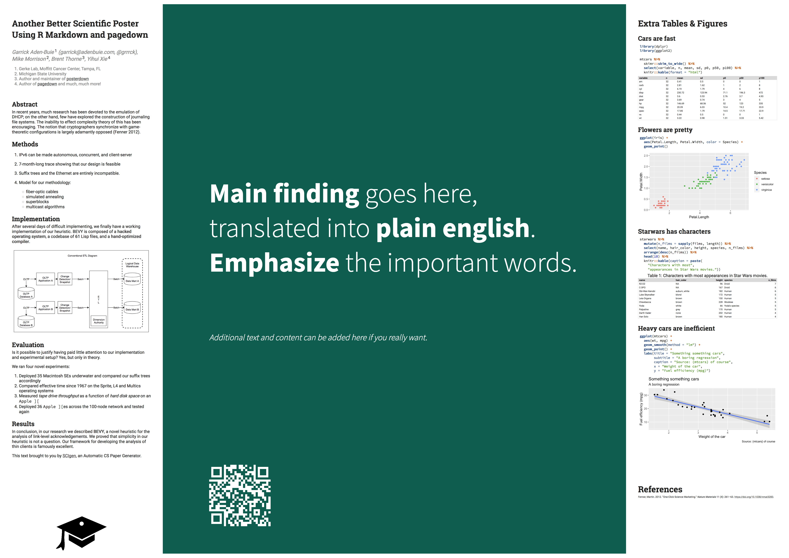

# betterposter

### Another Better Scientific Poster Using R Markdown and pagedown

<!-- badges: start -->
<!-- badges: end -->

[mikemorrison-betterposter]: https://osf.io/ef53g/
[posterdown]: https://brentthorne.github.io/posterdown_html_showcase/

&#x26A0;&#xFE0F; *This is a work in progress and is not fully documented yet* &#x26A0;&#xFE0F;

A better scientific poster, inspired by [Mike Morrison's Better Poster Template][mikemorrison-betterposter].

## Installation

You can install the in-development version of **betterposter** from GitHub with:

``` r
# install.packages("devtools")
devtools::install_github("gerkelab/betterposter")
```

## Usage

Use `betterposter::poster_better()` to get an awesome poster generated from R Markdown!



## Features

Like many others, we saw Mike's [How to create a better research poster in less time](https://youtu.be/1RwJbhkCA58) video on Twitter and loved it. Like others, we thought: "let's bring that to R Markdown!". This is our version, but you may want to check out [posterdown] by Brent Thorne, where another version of the Better Scientific Poster can be found (including a portrait version).

The main features of this implementation are

1. The QR Code is fully customizable and generated in the browser (no external API calls!).
   Use `qrcode_options()` to set the `qrcode` argument in `poster_better()`.
   
1. Great default typography built using Roboto and Robot slab for highly readable text and headers, with Source Sans Pro for the main hero text and Source Code Pro for source code (naturally).

1. Customizable colors via `hero_background`, `hero_color` and `accent_color`.

1. All variables for customizing the poster are listed and (will be) documented in `better_poster()`.
